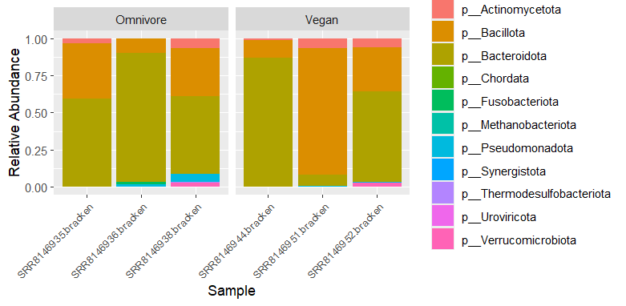
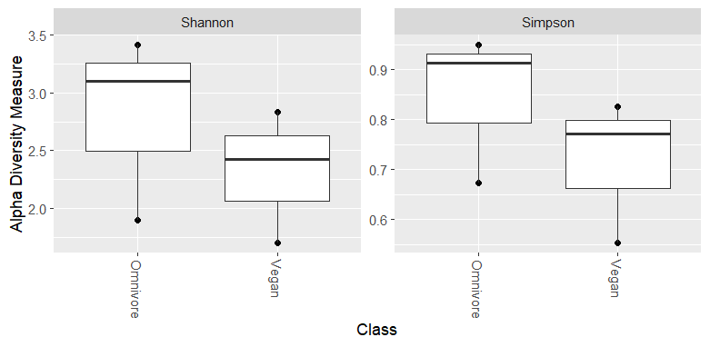
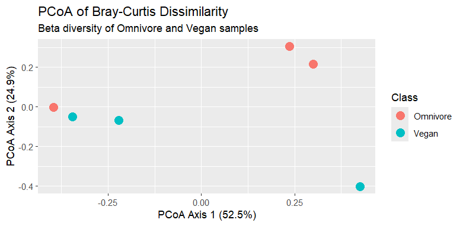
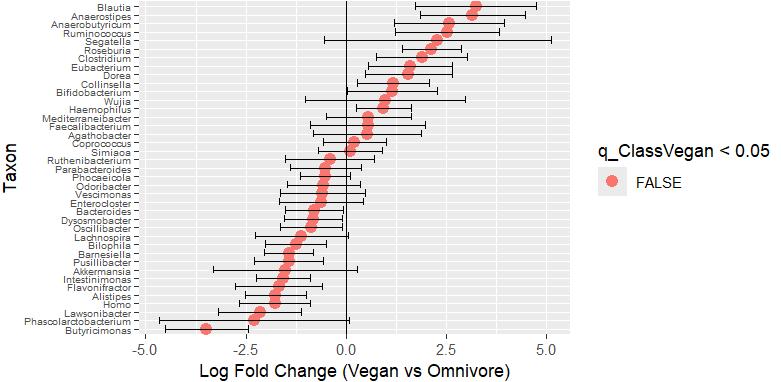

# Metabarcoding

**METHODS**

Raw shotgun metagenomic sequencing data were obtained from the European Nucleotide Archive (ENA) under study accession SRP126540, consisting of human gut microbiome samples form individuals with omnivore and vegan diets. Paried-end FASTQ files were downloaded directly using 'wget' form command line, A total of six samples (three omnivore, three vegan) were selected for analysis.

Quality control of raw sequencing reads was performed using FastQC (v0.11.9), which assesses per-base sequence quality, GC content, duplication levels, and adapter contamination (Andrews, 2010). All samples passed quality control metrics, no trimming or filtering was applied prior to the downstream process.

Taxonomic classification of sequencing reads was conducted using Kraken2 (v2.1.7.1), which is a k-mer based classification tool that assigns reads to a taxa based on exact matches to a reference database (Wood et al., 2019). A pre-built standard database (k2_standard_08_GB_20251015) was used. Kraken2 was run with a confidence threshold of 0.15 to reduce false-positive instances and paired-end reads were processed using 16 threads. The --memory-mapping option was not used due to executional issues and in the Narval (Compute Canada) computing environment.

Abundance estimation at the species level was refine using Bracken (v3.0.1), which re-estimates species abundances form Kraken2 outputs, using Bayesian models of k-mer distributions (Lu et al., 2017). Bracken was run with a read length parameter of 150 base pairs ( -r 150) and the taxonomic level set to species (-l S).

Kraken2 output reports were combined into a BIOM-format table using kraken-biom (v1.2.0), enabling integration with downstream statistical analysis tools. The BIOM table was imported into R using the phyloseq (v1.44.0) package for ecological and statistical analysis (McMurdie and Holmes, 2013).

All downstream analyses were performed in R. Relative abundance transformation and taxonomic aggregation were done using phyloseq. Alpha diversity metrics, including Shannon and Simpson indices, were calculated using the 'plot-richness' function. Beta diversity was assessed using Bray-Curtis dissimilarity and visualized using principal coordinates analysis (PCoA) using the 'ordinate' and 'plot_ordination' functions.

Statistical significance of the differences in microbial community composition between diet groups was evaluated using PERMANOVA from the 'vegan' (v2.6-4) package vis the 'adonis2' function (Oksanen et al., 2022).

Differential abundance analysis was conducted using ANCOMBC2, which accounts for compositional bias in microbiome data (Lin and Peddada, 2020). Taxa were tested at the genus level (Rank 6), with significance determined by using Holm-adjusted p-values ( q < 0.05).

All code for data collection, processing, analysis, and visualization is provided in this repository.

**RESULTS**

**Figure 1.** Taxonomic composition at the phylum level.Relative abundance of microbial taxa at the phylum level (Rank2) across omnivore and vegan samples. Samples are grouped by diet, with each bar representing a single sample. Bacteroidota and Bacillota dominate across all samples, with minor contributions from other phyla.

The taxonomic composition of gut microbiome samples varied across both omnivore and vegan groups, with phylum-level abundance dominated by Bacteroidotaand Bacillotain all samples (Figure 1). Although both groups displayed similar dominant phyla, variation in the relative abundance was observed between individual samples. This was particularly prevalent in the vegan group, where one sample showed a notable higher proportion of Bacillota. Minor phyla such as Actinomycetotaand Verrucomicrobiota were present at low relative abundances across all samples.

**Figure 2.** Alpha diversity of microbiome samples. Alpha diversity measures (Shannon and Simpson indices) for omnivore and vegan samples. Each point represents an individual sample, with boxplots indicating group distributions. Both metrics show overlapping distributions between groups, indicating similar within-sample diversity.

Alpha diversity analysis revealed variability within both dietary groups, but there was no clear separation between omnivore and vegan samples (Figure 2). Shannon diversity values broadly separated within each group, this indicates that there are differences in both richness and evenness among individual samples. Simpson diversity showed a similar pattern, with overlapping distributions between groups. Together, these results suggest that within-sample microbial diversity is comparable between omnivore and vegan individuals in this dataset.

**Figure 3.** Beta diversity (PCoA of Bray–Curtis dissimilarity). Principal coordinates analysis of Bray–Curtis dissimilarity between samples. Points are colored by diet group. The first two axes explain 52.5% and 24.9% of the variation, respectively. Partial clustering by diet is observed, though overlap and outliers indicate substantial variability.

Beta diversity analysis using Bray-Curtis dissimilarity and principal coordinates analysis (PCoA) revealed partial clustering of samples by diet (Figure 3). The first principal coordinate explained 52.5% of the variation, with omnivore samples tending to cluster on one side of the axis, and the vegan samples clustering on the other. However, overlap between groups and outlier data points suggest substantial within-group variability. Statistical test using PERMANOVA showed that the diet explained 18% of the variation in the microbial composition (R^2^ = 0.18), but this effect was found not to be statistically significant (p = 0.5).

**Figure 4.** Differential abundance analysis (ANCOMBC2). Log fold change in taxon abundance between vegan and omnivore samples (Vegan vs Omnivore). Points represent taxa at the genus level (Rank6), with error bars indicating standard errors. No taxa were significantly differentially abundant after multiple-testing correction (q < 0.05).

Differential abundance analysis using ANCOMBC2 did not identify any taxa as significantly different between omnivore and vegan samples after multiple testing correction ( q < 0.05) (Figure 4). Although several taxa had positive or negative log fold changes, which would indicate potential differences in abundance between groups, none met the threshold for statistical significance. Some taxa displayed confidence intervals that did not overlap zero, however, these differences were not robust after adjustment for multiple comparisons. This alludes to the fact that there's potentially high variability and limited statistical power.

**DISCUSSION**

This study investigated the impact of diet (omnivore and vegan) on gut microbiome. It focused on the composition, diversity, and differential abundance using shotgun metagenomic sequencing data, alongside downstream statistical analyses. While visual trends suggested differences between the two dietary groups, statistical testing revealed limited significant effects, showing both biological variability and methodological considerations.

At the community composition level (Figure 1), relative abundance profiles showed that both omnivore and vegan samples wee dominated by similar major phyla, including *Bacteroidota* and *Bacillota*. Although subtle shifts were observed between groups, these differences are not strong or pronounced. This aligns with previous findings that broad taxonomic composition is often conserved across individuals despite dietary differences (De Filippis et al., 2015). For example, plant-based diets have been associated with enrichment of fibre-degreading taxa such as *Prevotella*, whereas animal-based diets are often linked to a *Bacteroides* dominated community. However, these differences are not always large enough to produce clear separation at high taxonomic levels (Wu et al., 2011).

Alpha diversity analysis (Figure 2) indicated slightly lower Shannon and Simpson diversity in omnivore samples compared to vegan samples, though it's worth noting that variability within the groups was high. This suggests that while diet may influence microbial richness and evenness, inter-individual variation plays a considerable role. Large cohort studies have demonstrated that gut microbiome composition is influenced by numerous environmental and host-specific factors, these contributions often overshadow single variables such as diet (Falony et al., 2016). Therefore, the observed overlap between groups in these visualizations are consistent with known microbiome variability across individuals.

Beta diversity analysis using Bray-Curtis dissimilarity and PCoA (Figure 3) showed partial clustering of omnivore and vegan samples, especially along the first principal component. However, this separation was not statistically significant, confirmed by PERMANOVA results (R^2^ = 0.10, p = 0.15). This indicated that only a small proportion of the variation in microbiome composition can be explained by diet, in this dataset. Similar findings have been reported in controlled dietary intervention studies, where microbiome changes can happen rapidly but may not always produce strong and consistent clustering among individuals (David et al., 2014). The lack of decisiveness in this study is likely due to the small sample sie (n = 6), alongside anticipated high biological variability.

Differential abundance analysis using ANCOMBC2 (Figure 4) did not identify any taxa as significantly different between vegan and omnivore groups after multiple testing correction. While several taxa exhibited non-zero log fold changes, most of their confidence intervals overlapped zero, which indicates uncertainty. These findings are consistent with the compositional nature of microbiome data, where relative abundances are constrained, and statistical detection is often challenging (Gloor et al., 2017). Also noted by Gloor et al., microbiome datasets represent relative proportions rather than absolute abundances, which can introduce false correlations and reduce statistical power, if not properly accounted for.

Notably, the absence of statistically significant differences does not imply that diet indeed has no effect on the microbiome. Instead, it suggests that in this particular dataset, dietary effects are subtle relative to background variability.  Previous studies have shown that diet can rapidly alter microbial composition and function, particularly at the smaller taxonomic or metabolic levels (David et al., 2014). Additionally, long-term dietary patterns may influence microbial community structure in more stable ways, such as through enterotype associations (Wu et al., 2011). However, detection of these effects reliably would typically require larger cohorts, with more specific and controlled study designs.

In summary, the results found in this study demonstrate that while diet is an important factor which influences the gut microbiome, its effects may not always be detectable using small sample sizes and standard statistical approaches. The observed trends in composition and diversity are consistent with the literature, but the lack of statistical significance highlights the importance of considering data structure and analytical limitations for any studies concerning the microbiome.

